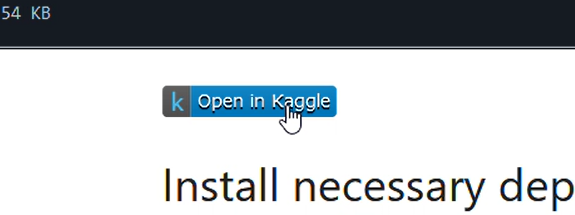

# Simple Extractive Text Summarization

This is a simple project that implements extractive text summarization. Extractive text summarization is a technique that generates a summary by selecting important sentences from the input text, rather than generating new sentences. The model ranks sentences based on their importance using an algorithm, and combines the most relevant ones to form a summary. This approach does not involve deep learning or training, as seen in common machine learning models. Instead, it focuses on summarizing based on the given input text.

This project is implemented in two programming languages. The main code is written in Python, which is commonly used for developing machine learning models and offers a rich set of libraries for calculations. The second part of the project is written in JavaScript, which enables the summarization model to run entirely on the client's device (in the web browser). Although the code is in two different languages, the underlying logic is the same.

## Techniques ⚙️

This model uses **TF-IDF (Term Frequency-Inverse Document Frequency)** for vectorization and **cosine similarity** to measure the similarity between sentences. This technique is relatively simple but can still produce good summaries.

## Notebook 📒

You can easily access the Jupyter notebook by opening the [`notebook.ipynb`](notebook/ipynb) file. If you'd like to customize it with your own dataset or modify the model logic to improve performance, you can copy or download the notebook to your local machine.

> [!TIP]  
> To open the notebook without worrying about project setup and dependencies, simply use the **Open in Kaggle** widget. This will launch the notebook directly in your Kaggle account.  
> 

## Web App 🌐

If you want to see how the model is deployed in a real application, check out the [**web**](web/) directory, which contains the source code for the web app. The web app is built entirely in native JavaScript, meaning it can run directly in the browser without requiring server-side configuration. All computations are handled on the client's device.

Additionally, you can try the live implementation of the text summarization directly by visiting the deployed web app on GitHub Pages. You can input any text and get a summary in real-time, all within your web browser. 

👉🏻 [**Try the live demo here!**](https://farrelad.github.io/Simple-Extractive-Text-Summarization/)

---
